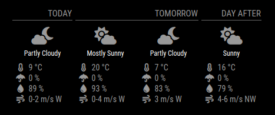

# MMM-2Day-NOAA-Forecast

This is a module for [MagicMirror²](https://github.com/MichMich/MagicMirror/tree/develop) that uses the [NOAA National Weather Service API](https://www.weather.gov/documentation/services-web-api) forecast to show a consecutive 4 12-hr forecast. Initially, I tried to use the [OpenWeather One Call 3.0 API](https://openweathermap.org/api/one-call-3), but it gives a pretty inaccurate forecast. A project called [MMM-NOAA](https://github.com/cowboysdude/MMM-NOAA) already exists, but it uses the [WeatherBit API](https://www.weatherbit.io/api/weather-forecast-api), not the NOAA API.

I just wanted a reliable forecast that doesn't change or go down, and I think the NOAA National Weather Service is the best because it doesn't require user registration nor APK key currently (although I think they're working on a change for that).

## Screenshot




## Installation

### Install `MMM-2Day-NOAA-Forecast`

Under your MagicMirror's `modules` folder, do:

```shell
cd <your-magic-mirror-path>/modules
git clone https://github.com/jinserk/MMM-2Day-NOAA-Forecast
cd MMM-2Day-NOAA-Forecast
```

### Install node dependenties

```shell
npm install
```

## Config

The entry in `config.js` can include the following options:

|Option|Description|Type|Default Value|
|---|---|---|---|
|`lat`|This is the latitude of the location you want to get the weather for.|`number`|`0.0`|
|`lon`|This is the longitude of the location you want to get the weather for.|`number`|`0.0`|
|`units`|The units you want the weather reporting in. Use `metric` for metric OR otherwise for imperial.|`string`|`metric`|
|`interval`|How often the weather is updated in millisecond.|`integer`|`600000` (= 10 min)|

### An example of `config.js`

```javascript
{
    module:     'MMM-2Day-NOAA-Forecast',
    position:   'top_right',
    config: {
      lat:       42.36114,
      lon:       -71.05908,
      units:     'metric',
      interval:  10 * 60 * 1000
    }
},
```

## Acknowledgement

This module originates from the code in [MMM-3Day-Forecast](https://github.com/nigel-daniels/MMM-3Day-Forecast). The code and CSS have changed a lot, but all the credit for the layout and skeleton goes to the project.
